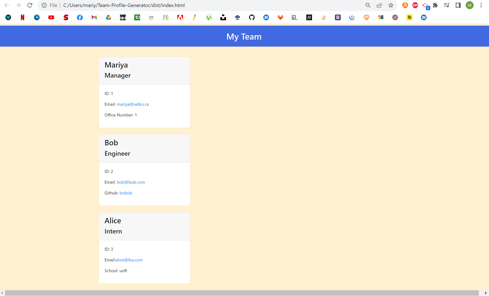

# Team Profile Generator

## Description

This project dynamically generates HTML code based on console input. When the client runs the program, they are presented with a series of prompts asking them for information about their team manager, following by other employees of their choice. It then creates an HTML page utilizing all of the information provided. My application uses inquirer and fs for the questions and the HTML generation respectively. 

## Installation and Usage

Run npm install, followed by node index.js. Follow the prompts in the console. 

## Screenshots

Screenshot of sample HTML generated using this application:

